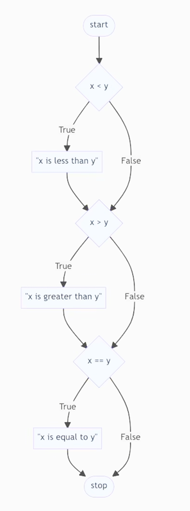

# Week 1: Conditionals

## Conditionals

- Hability to ask and answer questions

### Comparison Operators in Python

| Symbol | Meaning                  |
|--------|--------------------------|
| `>`    | Greater than             |
| `<`    | Less than                |
| `==`   | Equal to                 |
| `!=`   | Not equal to             |
| `>=`   | Greater than or equal to |
| `<=`   | Less than or equal to    |


## if

### Example of a code using if

```python
x = int(input("What's x? "))
y = int(input("What's y? "))

if x < y:
    print("x is less than y")
if x > y:
    print("x is greater than y")
if x == y:
    print("x is equal to y")
```

- In this example "x < y" is a boolean expression

### Flowchart of the code



## elif

### Example of a code using elif

```python
x = int(input("What's x? "))
y = int(input("What's y? "))

if x < y:
    print("x is less than y")
elif x > y:
    print("x is greater than y")
elif x == y:
    print("x is equal to y")
```

## else

### Example of a code using else

```python
 

## or 

## Not Equal


## Identation, Colons 


## and 


## Chaining Comparison Operators


## Bugs


## Modulo 


## Boolean 


## Pythonic Expressions 


## match
