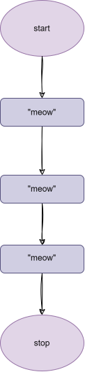
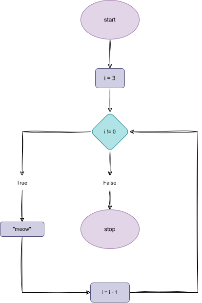

# Week 2: Loops  


## Loops 

- The hability of doing something multiple times  

## cat.py 

### Example of code

```python
print("meow")
print("meow")
print("meow")
```

#### Flowchart of the code

<p align="center">
    
</p>


## while

- Is a way to repeat a block of code while a condition is true

### While using substraction

```python
i = 3 
while i != 0:
    print("meow")
    i = i - 1
```

#### Flowchart of the code

<p align="center">
    
</p>


### While using addition

```python
i = 0
while i < 3:
    print("meow")
    i = i + 1
```

#### Flowchart of the code 

<p align="center">
    


## for 

- Is a way to repeat a block of code a number of times

### For using a list

```python
for i in [0, 1, 2]:
    print("meow")
```

### For using range

```python
for i in range(3):
    print("meow")
```

### Pythonic way v1

- The _ is a convention to indicate that the variable is not going to be used or is not important

```python
for _ in range(3):
    print("meow")
```

### Pythonic way v2

```python
print("meow\n" * 3, end="")
```


## Validating input

- Is a way to ensure that the input is correct

### Example of code

```python
while True:
    n = int(input("What's n? "))
    if n > 0:
        break

for _ in range(n):
    print("meow")
```

### Exampo of code using a function

```python
def main():
    number = get_number()
    meow(number)


def get_number():
    while True:
        n = int(input("What's n? "))
        if n > 0:
            return n


def meow(n):
    for _ in range(n):
        print("meow")


main()
```


## Iteration with Lists

- Is a way to iterate over a list

### Example of code

```python
students = "[Hermione, Harry, Ron]"

for student in students:
    print(student)
```


## len

- Is a way to get the length of a list

### Example of code

```python
students = ["Hermione", "Harry", "Ron"]

for i in range(len(students)):
    print(i + 1, students[i])
```


## Dictionaries

- Is a way to store key-value pairs

### Example of the code in a manual way

```python
students = {
    "Hermione": "Gryffindor",
    "Harry": "Gryffindor",
    "Ron": "Gryffindor",
    "Draco": "Slytherin",
}

print(students["Hermione"])
print(students["Harry"])
print(students["Ron"])
print(students["Draco"])
```

### Example of the code using a loop

```python
students = {
    "Hermione": "Gryffindor",
    "Harry": "Gryffindor",
    "Ron": "Gryffindor",
    "Draco": "Slytherin",
}

for student in students:
    print(student, students[student], sep=", ")
```


## List of Dictionaries

students = [
    {"name": "Hermione", "house": "Gryffindor", "patronus": "Otter"},
    {"name": "Harry", "house": "Gryffindor", "patronus": "Stag"},
    {"name": "Ron", "house": "Gryffindor", "patronus": "Jack Russell terrier"},
    {"name": "Draco", "house": "Slytherin", "patronus": None},
]

for student in students:
    print(student["name"], student["house"], student["patronus"], sep=", ")
