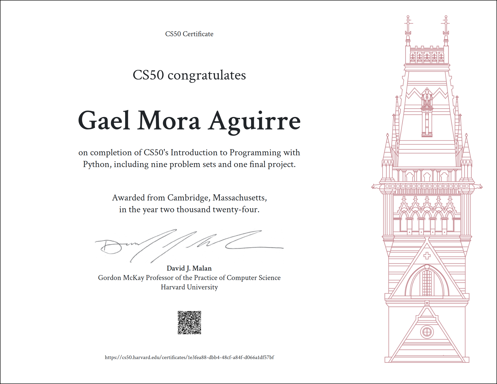

# CS50 Python

This is a small README placeholder so the repository doesn't look empty.

# DeepSource status

<div align="center">
  
  
</div>

# CS50’s Introduction to Programming with Python

## Certificate 

<p align="center">
    
</p>

## Week 0: Functions, Variables

### Key Concepts

- `Functions`: a block of code that performs a specific task.
- `Bugs and Debugging`: mistakes in the code and how to fix them.
- `Data Types`: the type of data that a variable can store.
- `Named Parameters`: parameters that are passed by name.
- `String Methods`: methods that can be used with strings.
- `Integers and Operators`: operators that can be used with integers.
- `Type Conversion`: converting one data type to another.

### Notes

<details>
<summary>Week 0 notes</summary>

**Note: I have alreaady some experience with Python, but I will worte down as much as possible either way.**

## Hello Bison in Python
```python
print("Hello Bison!")
```

 ## Functions

- We just used the `print` function.

- Argument: value passed to a function.

- Side effects: printing to the console.

## Bugs and Debugging

- Bugs: mistakes in the code.

- Debugging: finding and fixing bugs.  

## Return values and Variables

- Return values: values returned by functions.

- Variables: store values for later use.

## Comments and Pseudocode

- Comments: notes to self and others.

- Pseudocode: planning code before writing it.

## Multiple function arguments

- String: a sequence of characters.

- Concateation: combining strings.

### Table of Data Types

| Data Type   | Description                                       |
|-------------|---------------------------------------------------|
| `int`       | Integer numbers (e.g., 5, -3, 100)                |
| `float`     | Floating point numbers (e.g., 3.14, -0.001, 2.0)  |
| `complex`   | Complex numbers (e.g., 3 + 4j, -2.5 + 0.1j)       |
| `str`       | String (e.g., "hello", 'world', "123")            |
| `list`      | List (e.g., [1, 2, 3], ['a', 'b', 'c'])           |
| `tuple`     | Tuple (e.g., (1, 2, 3), ('a', 'b', 'c'))          |
| `set`       | Set (e.g., {1, 2, 3}, {'a', 'b', 'c'})            |
| `dict`      | Dictionary (e.g., {'key': 'value'}, {1: 'one', 2: 'two'}) |
| `bool`      | Boolean (True or False)                           |
| `bytes`     | Immutable bytes sequence (e.g., b'hello', b'\x00\x01\x02') |

## Named Parameters 

### Documentation for print function

```python
print(*objects, sep=' ', end='\n', file=sys.stdout, flush=False)
```

- *objects: zero or more objects to print.
- sep: how to separate objects.
- end: what to print at the end.
- file: where to print.
- flush: whether to forcibly flush the stream.

### Parameters vs Arguments

- Parameters: variables in the function definition.
- Arguments: values passed to the function.

### Small pieace of code to demonstrate how to change the end parameter behavior

```python
print("Hello ", end="")
print("Bison!")
```
The expected output is `Hello Bison!`.

### Named parameters vs Positional parameters

- Named parameters: they are optional and can be passed in any order.
- Positional parameters: they are required and must be passed in the correct order.

## Escaping Characters

- Escape character: backslash (\).

## f-strings

- f-string: formatted string literal.

### Example of code using f-strings

```python
name = "Bison"
print(f"Hello, {name}!")
```
The expected output is `Hello, Bison!`.

## String Methods

- .strip(): remove whitespace.

- .capitalize(): capitalize the first letter.

- .title(): capitalize the first letter of each word.

- .lstrip(): remove whitespace from the left.

- .rstrip(): remove whitespace from the right.

### Example of code using .strip() and .title()

```python
name = input("What's your name? ").strip().title()

print(f"Hello, {name}!")
```

## Style 

- Style: how code looks and is organized.

- PEP 8: Python Enhancement Proposal 8.

## split 

- .split(): split a string into a list.

### Example of code using .split()

```python
names = input("Enter names separated by commas: ").split(", ")
print(names)
```
Expected output: `['Alice', 'Bob', 'Charlie']`.

## Integers and Operators

- Integer: whole numbers.

- Operators: symbols that perform operations.

### Table of Operators

| Operator | Name           | Description                        |
|----------|----------------|------------------------------------|
| +        | Addition       | Adds two numbers.                  |
| -        | Subtraction    | Subtracts two numbers.             |
| *        | Multiplication | Multiplies two numbers.            |
| /        | Division       | Divides two numbers.               |
| //       | Floor division | Divides two numbers and rounds down. |
| %        | Modulus        | Returns the remainder of the division. |
| **       | Exponentiation | Raises a number to the power of another. |

### Interactive mode 

The interactive mode is a way to run Python code line by line.

## Calculator.py

```python
x = input("What's x? ")
y = input("What's y? ")

z = x + y
print(z)
```

## Type Conversion

- Type conversion: converting one data type to another.

- int(): convert to integer.

### Example of code using int()

```python
x = int(input("What's x? "))
y = int(input("What's y? "))

print(x + y)
```

## Foating Point Values

- Floating point values: decimal numbers.

- float(): convert to floating point.

### Example of code using float()

```python
x = float(input("What's x? "))
y = float(input("What's y? "))

print(x + y)
```

### Rounding Numbers

- round(): round a number to a specified number of decimal places.

```python
round(number[, ndigits])
```
#### Example of code using round()

```python
x = float(input("What's x? "))
y = float(input("What's y? "))

z = round(x + y)

print(z)
```

## Numeric Formatting

- f-string: formatted string literal.


### Example of code using f-string to format a number

```python
x = float(input("What's x? "))
y = float(input("What's y? "))

z = round(x + y)

print(f"{z:,}")
```

## Division 

- /: division.

### Example of code using / and //

```python
x = float(input("What's x? "))
y = float(input("What's y? "))

z = x / y

print(f"{z:.2f}")
```

## Defining Functions

- def: define a function.

### Example of code defining a function

```python
def main():
    name = input("What's your name? ")
    hello(name)


def hello(to="Bison"):
    print("Hello ", to)


main()
```

## Scope 

- Scope: where a variable is accessible.

## Return Values

- return: return a value from a function.

### Example of code using return

```python
def main():
    x = int(input("What's x? "))
    print("x squared is", square(x))

def square(n):
    return pow(n, 2)

main()
```
</details>

## Week 1: Conditionals

### Key Concepts

- `Comparison Operators`: operators that compare two values.
- `if`: a way to run code conditionally.
- `elif`: a way to run code conditionally if the first condition is false.
- `else`: a way to run code if all other conditions are false.
- `or`: a way to combine conditions.
- `not equal`: a way to check if two values are not equal.
- `and`: a way to combine conditions.
- `chains`: a way to combine multiple conditions.
- `modulo`: a way to get the remainder of a division.
- `boolean`: a way to represent true or false values.
- `pythonic expressions`: a way to write code in a more concise way.
- `match`: a way to match a value to a pattern.

### Notes

<details>
<summary>Week 1 notes</summary>

## Conditionals

- Hability to ask and answer questions

### Comparison Operators in Python

| Symbol | Meaning                  |
|--------|--------------------------|
| `>`    | Greater than             |
| `<`    | Less than                |
| `==`   | Equal to                 |
| `!=`   | Not equal to             |
| `>=`   | Greater than or equal to |
| `<=`   | Less than or equal to    |


## if

### Example of a code using if

```python
x = int(input("What's x? "))
y = int(input("What's y? "))

if x < y:
    print("x is less than y")
if x > y:
    print("x is greater than y")
if x == y:
    print("x is equal to y")
```

- In this example "x < y" is a boolean expression

#### Flowchart of the code

<p align="center">
    
</p>


## elif

### Example of a code using elif

```python
x = int(input("What's x? "))
y = int(input("What's y? "))

if x < y:
    print("x is less than y")
elif x > y:
    print("x is greater than y")
elif x == y:
    print("x is equal to y")
```

#### Flowchart of the code

<p align="center">
    
</p>


## else

### Example of a code using else

```python
x = int(input("What's x? "))
y = int(input("What's y? "))

if x < y:
    print("x is less than y")
elif x > y:
    print("x is greater than y")
else:
    print("x is equal to y")
```

#### Flowchart of the code 

<p align="center">
    
</p>
 

## or 

### Example of a code using or

```python
x = int(input("What's x? "))
y = int(input("What's y? "))

if x < y or x > y:
    print("x is not equal to y")
else:
    print("x is equal to y")
```

#### Flowchart of the code 

<p align="center">
    
</p>


## Not Equal

### Example of a code using not equal

```python
x = int(input("What's x? "))
y = int(input("What's y? "))

if x != y:
    print("x is not equal to y")
else:
    print("x is equal to y")
```

#### Flowchart of the code 

<p align="center">
    
</p>


### Example of a code using equal 

```python
x = int(input("What's x? "))
y = int(input("What's y? "))

if x == y:
    print("x is equal to y")
else:
    print("x is not equal to y")
```

#### Flowchart of the code

<p align="center">
    
</p>


## Identation, Colons 

- Identation is important in Python, if you don't use it, you will get an error

- The colon is also important, it tells Python that the next line is going to be a block of code


## and 

### Example of a code using and

```python
score = int(input("Score: "))

if score >= 90 and score <= 100:
    print("Grade: A")
elif score >= 80 and score < 90:
    print("Grade: B")
elif score >= 70 and score < 80:
    print("Grade: C")
elif score >= 60 and score < 70:
    print("Grade: D")
else:
    print("Grade: F")
```


## Chaining Comparison Operators

### Example of a code using chaining comparison operators

```python
score = int(input("Score: "))

if score >= 90:
    print("Grade: A")
elif score >= 80:
    print("Grade: B")
elif score >= 70:
    print("Grade: C")
elif score >= 60:
    print("Grade: D")
else:
    print("Grade: F")
```


## Bugs

### Example of a code with a bug: using if instead of elif

```python
score = int(input("Score: "))

if score >= 90:
    print("Grade: A")
if score >= 80:
    print("Grade: B")
if score >= 70:
    print("Grade: C")
if score >= 60:
    print("Grade: D")
```


## Modulo 

### Some remaining operators

| Symbol | Meaning             |
|--------|---------------------|
| `+`    | Addition            |
| `-`    | Subtraction         |
| `*`    | Multiplication      |
| `/`    | Division            |
| `%`    | Modulo (Remainder)  |

### Example of a code using modulo

```python
x = int(input("What's x? "))

if x % 2 == 0:
    print("x is Even")
else:
    print("x is Odd")
```

## Boolean 

### Example of a code using boolean

```python
def main():
    x = int(input("What's x? "))
    y = int(input("What's y? "))

    if is_even(x):
        print("x is Even")
    else:
        print("x is Odd")


def is_even(n):
    if n % 2 == 0:
        return True
    else:
        return False


main()
```

## Pythonic Expressions 

### Example of a code using Pythonic Expressions

```python
def main():
    x = int(input("What's x? "))
    y = int(input("What's y? "))

    if is_even(x):
        print("x is Even")
    else:
        print("x is Odd")


def is_even(n):
    return n % 2 == 0


main()
```


## match

### Example of a code using match

```python
name = input("What's your name? ")

match name:
    case "Harry" | "Herminone" | "Ron":
        print("Gryffindor")
    case  "Draco:":
        print("Slytherin")
    case _:
        print("Who?")

```
</details>

## Week 2: Loops

### Key Concepts

- `Loops`: the hability of doing something multiple times.
- `while`: a way to repeat a block of code while a condition is true.
- `for`: a way to repeat a block of code a number of times.
- `Validating input`: a way to ensure that the input is correct.
- `Iteration with Lists`: a way to iterate over a list.
- `len`: a way to get the length of a list.
- `Dictionaries`: a way to store key-value pairs.
- `List of Dictionaries`: a way to store a list of dictionaries.
- `Nested Loops`: a way to have a loop inside another loop.

### Notes

<details>
<summary>Week 2 notes</summary>

## Loops

- The hability of doing something multiple times  

## cat.py

### Example of code

```python
print("meow")
print("meow")
print("meow")
```

#### Flowchart of the code

<p align="center">
    
</p>

## while

- Is a way to repeat a block of code while a condition is true

### While using substraction

```python
i = 3 
while i != 0:
    print("meow")
    i = i - 1
```

#### Flowchart of the code

<p align="center">
    
</p>

### While using addition

```python
i = 0
while i < 3:
    print("meow")
    i = i + 1
```

#### Flowchart of the code

<p align="center">
    

## for

- Is a way to repeat a block of code a number of times

### For using a list

```python
for i in [0, 1, 2]:
    print("meow")
```

### For using range

```python
for i in range(3):
    print("meow")
```

### Pythonic way v1

- The _ is a convention to indicate that the variable is not going to be used or is not important

```python
for _ in range(3):
    print("meow")
```

### Pythonic way v2

```python
print("meow\n" * 3, end="")
```

## Validating input

- Is a way to ensure that the input is correct

### Example of code

```python
while True:
    n = int(input("What's n? "))
    if n > 0:
        break

for _ in range(n):
    print("meow")
```

### Exampo of code using a function

```python
def main():
    number = get_number()
    meow(number)


def get_number():
    while True:
        n = int(input("What's n? "))
        if n > 0:
            return n


def meow(n):
    for _ in range(n):
        print("meow")


main()
```

## Iteration with Lists

- Is a way to iterate over a list

### Example of code

```python
students = "[Hermione, Harry, Ron]"

for student in students:
    print(student)
```

## len

- Is a way to get the length of a list

### Example of code

```python
students = ["Hermione", "Harry", "Ron"]

for i in range(len(students)):
    print(i + 1, students[i])
```

## Dictionaries

- Is a way to store key-value pairs

### Example of the code in a manual way

```python
students = {
    "Hermione": "Gryffindor",
    "Harry": "Gryffindor",
    "Ron": "Gryffindor",
    "Draco": "Slytherin",
}

print(students["Hermione"])
print(students["Harry"])
print(students["Ron"])
print(students["Draco"])
```

### Example of the code using a loop

```python
students = {
    "Hermione": "Gryffindor",
    "Harry": "Gryffindor",
    "Ron": "Gryffindor",
    "Draco": "Slytherin",
}

for student in students:
    print(student, students[student], sep=", ")
```

## List of Dictionaries

```python
students = [
    {"name": "Hermione", "house": "Gryffindor", "patronus": "Otter"},
    {"name": "Harry", "house": "Gryffindor", "patronus": "Stag"},
    {"name": "Ron", "house": "Gryffindor", "patronus": "Jack Russell terrier"},
    {"name": "Draco", "house": "Slytherin", "patronus": None},
]

for student in students:
    print(student["name"], student["house"], student["patronus"], sep=", ")
```

## Nested Loops

- Is a way to have a loop inside another loop

### Example of code v1

```python
def main():
    print_square(3)


def print_square(size):

    # For each row in square
    for _ in range(size):

        # For each brick in row
        for _ in range(size):

            # Print brick
            print("#", end="")

        print()


main()
```

### Example of code v2

```python
def main():
    print_square(3)


def print_square(size):
    for i in range(size):
        for j in range(size):
            print("#", end="")
        print()


main()
```

### Example of code v3

```python
def main():
    print_square(3)


def print_square(size):
    for _ in range(size):
        print("#" * size)


main()
```

### Example of code v4

```python
def main():
    print_square(3)


def print_square(size):
    for _ in range(size):
        print_row(size)


def print_row(width):
    print("#" * width)


main()
```

#### Expected output for all examples

```
###
###
###
```
</details>

## Week 3: Exceptions

### Key Concepts

- `Exceptions`: a way to handle errors in the code.
- `Syntax Error`: a mistake in the code that the python interpreter can not execute.
- `ValueError`: an error that happens when you try to convert a string to a number, but the string is not a number.
- `try, except`: a way to handle exceptions.
- `NameError`: an error that happens when you try to use a variable that is not defined.
- `else`: a way to run a code if the try block does not raise an exception.
- `Reprompting, break`: a way to reprompt the user if the input is not valid.
- `get_int`: a way to create a function to get an integer from the user.
- `pass`: a way to do nothing.
- `function arguments`: a way to pass arguments to a function.
- `raise`: a way to raise an exception.

### Notes

<details>
<summary>Week 3 notes</summary>

## Exceptions

That means that something went wrong in the program. It is an error that happens during the execution of the program.

## Syntax Error

This is just and introductory example. The error is in the syntax of the code. It is a mistake in the code that the python interpreter can not execute.

```python
print("Hello World)
```

This error is a error that you need to fix, you can't create a code to handle this error. 

## ValueError

This error happens when you try to convert a string to a number, but the string is not a number.

```python 
x = int(input("What's x? "))
print(f"x is {x}")
```

This programs works fine if you input a number, but if you input a string, it will raise a ValueError. 

## try, except

You can handle exceptions with the try and except blocks. 

```python
try:
    x = int(input("What's x? "))
    print(f"x is {x}")
except ValueError:
    print("x is not an integer")
```

## NameError

This error happens when you try to use a variable that is not defined. 

```python
try:
    x = int(input("What's x? "))
except ValueError:
    print("x is not an integer")

print(f"x is {x}")
```

## else

You can use the else block to run a code if the try block does not raise an exception. 

```python
try:
    x = int(input("What's x? "))
except ValueError:
    print("x is not an integer")
else:
    print(f"x is {x}")
```

## Reprompting, break

You can use a while loop to reprompt the user if the input is not valid. 

```python
while True:
    try:
        x = int(input("What's x? "))
    except ValueError:
        print("x is not an integer")
    else:
        break

print(f"x is {x}")
```

## get_int

You can create a function to get an integer from the user. 

```python
def main():
    x = get_int()
    print(f"x is {x}")

def get_int():
    while True:
        try:
            return x = int(input("What's x? "))
        except ValueError:
            print("x is not an integer")

main()
```

## pass

You can use the pass statement to do nothing. 

```python
def main():
    x = get_int()
    print(f"x is {x}")

def get_int():
    while True:
        try:
            return x = int(input("What's x? "))
        except ValueError:
            pass

main()
```

*Note: In this case I wouln't use the pass argument, I think as a user would be weird to just be asked again and again for the same input.*

## function arguments

This is a refined version of the get_int function. 

```python
def main():
    x = get_int("What's x? ")
    print(f"x is {x}")

def get_int(prompt):
    while True:
        try:
            return x = int(input(prompt))
        except ValueError:
            pass

main()
```

## raise

This was just a quick mention of the raise statement.
</details>

## Week 4: Libraries

### Key Concepts

- `Libraries`: a piece of code that someone else wrote that you can use in your code.
- `Modules`: is a library that has one or more functions built into it.
- `import`: to use a module, you have to import it.
- `from`: is the keyword to import a specific function from a module.
- `statistics`: is a built-in module in Python. It has a set of functions to calculate statistics.
- `Command-line Arguments, sys`: sys module, provides access to some variables used or maintained by the interpreter and to functions that interact strongly with the interpreter.
- `Packages, PyPI, pip`: Package: is a collection of modules. PyPI: Python Package Index, is a repository of software for the Python programming language. pip: is a package installer for Python.
- `Custom Libraries`: create your own library.

### Notes

<details>
<summary>Week 4 notes</summary>

## Libraries

A piece of code that someone else wrote that you can use in your code.

## Modules

Is a library that has one or more functions built into it.

Re-usability code. 

### random

random is a built-in module in Python. It has a set of functions to generate random numbers.

[Documentation](https://docs.python.org/3/library/random.html)

## import

To use a module, you have to import it.

```python
import random

coin = random.choice(["head", "tails"])
print(coin)
```

### from

Is the keyword to import a specific function from a module.

```python
from random import choice

coin = choice(["head", "tails"])
print(coin)
```

### randint, shuffle

#### randint

```python
import random

number = random.randint(1, 10)
print(number)
```

#### shuffle

```python
import random

cards = ["jack", "queen", "king"]
random.shuffle(cards)
for card in cards:
    print(card)
```

## statistics

statistics is a built-in module in Python. It has a set of functions to calculate statistics.

[Documentation](https://docs.python.org/3/library/statistics.html)

```python
import statistics

print(statistics.mean([100, 90]))
```

## Command-line Arguments, sys

sys module, provides access to some variables used or maintained by the interpreter and to functions that interact strongly with the interpreter.

[Documentation](https://docs.python.org/3/library/sys.html)

- sys.argv: argument vector, a list of strings representing the arguments.

```python
import sys

if len(sys.argv) < 2:
    print("Too few arguments")
elif len(sys.argv) > 2:
    print("Too many arguments")
else:
    print("hello, my name is", sys.argv[1])
```

### sys.exit

Exit from Python.

```python
import sys

if len(sys.argv) < 2:
    sys.exit("Too few arguments")
elif len(sys.argv) > 2:
    print("Too many arguments")

print("hello, my name is", sys.argv[1])
```

## slices

A slice is a portion of a list.

```python
import sys

if len(sys.argv) < 2:
    sys.exit("Too few arguments")

for arg in sys.argv[1:]:
    print("hello, my name is", arg)
```

## Packages, PyPI, pip

- Package: is a collection of modules.
- [PyPI](pypi.org): Python Package Index, is a repository of software for the Python programming language.
- pip: is a package installer for Python.

### cowsay 

[Documentation](https://pypi.org/project/cowsay/)

#### Install

```bash
pip install cowsay
```

#### Usage

```python
import cowsay
import sys

if len(sys.arg) == 2:
    cowsay.cow("hello, " + sys.argv[1])
```

### APIs, requests, JSON

- API: Application Programming Interface.
- [requests](pypi.org/project/requests): is a simple HTTP library for Python.
- [JSON](https://docs.python.org/3/library/json.html): JavaScript Object Notation, a language-independent data format.

#### Pretty print JSON

```python
import json
import requests
import sys

if len(sys.argv) != 2:
    sys.exit()

response = requests.get("https://itunes.apple.com/search?entity=song&limit=1&term=" + sys.argv[1])
print(json.dumps(response.json(), indent=2))
```

#### Printing the track name from the API

```python
import json
import requests
import sys

if len(sys.argv) != 2:
    sys.exit()

response = requests.get("https://itunes.apple.com/search?entity=song&limit=50&term=" + sys.argv[1])

o = response.json()
for result in o["results"]:
    print(result["trackName"]) 
```

## Custom Libraries

Create your own library.

### sayings.py

```python
def main():
    hello("world")
    goodbye("world")


def hello(name):
    print(f"hello, {name}")


def goodbye(name):
    print(f"goodbye, {name}")


if __name__ == "__main__":
    main()
```

### say.py

```python
import sys

from sayings import hello

if len(sys.argv) == 2:
    hello(sys.argv[1])
```
</details>

## Week 5: Unit Tests

### Key Concepts

- `Unit Tests`: is a way to test the code you wrote.
- `assert`: is a way to test the code you wrote.
- `AssertionError`: is a way to handle an AssertionError.
- `pytest`: is a testing framework that makes it easy to write small tests.
- `Side Effects and Testing`: is a way to test the code you wrote.
- `Collection of Tests`: is a way to group tests together.

### Notes

<details>
<summary>Week 5 notes</summary>

## Unit Tests

Is a way to test the code you wrote.

## Testing calculator.py

### Calculator.py code

```python
def main():
    x = int(input("What's x? "))
    print("x squared is", square(x))


def square(n):
    return n * n


if __name__ == "__main__":
    main()
```

### test_calculator.py code

```python
from calculator import square


def main():
    test_square()


def test_square():
    if square(2) != 4:
        print("2 squared is not 4")
    if square(3) != 9:
        print("3 squared is not 9")


if __name__ == "__main__":
    main()
```

## assert

_testing [this code](#calculatorpy-code)_

```python
def main():
    test_square()


def test_square():
    assert square(2) == 4
    assert square(3) == 9


if __name__ == "__main__":
    main()
```

## AssertionError

How to handle an AssertionError

### First "bad" try

_testing [this code](#calculatorpy-code)_

```python
def main():
    test_square()


def test_square():
    try:
        assert square(2) == 4
    except AssertionError:
        print("2 squared is not 4")
    try:
        assert square(3) == 9
    except AssertionError:
        print("3 squared is not 9")


if __name__ == "__main__":
    main()
```

### Second "bad" try with more examples

_testing [this code](#calculatorpy-code)_

```python
def main():
    test_square()


def test_square():
    try:
        assert square(2) == 4
    except AssertionError:
        print("2 squared is not 4")
    try:
        assert square(3) == 9
    except AssertionError:
        print("3 squared is not 9")
    try:
        assert square(-3) == 9
    except AssertionError:
        print("-3 squared is not 9")
    try:
        assert square(0) == 0
    except AssertionError:
        print("0 squared is not 0")


if __name__ == "__main__":
    main()
```

## pytest

### Installation

```bash
$ pip install pytest
```

### Documentation

[pytest documentation](https://docs.pytest.org/en/latest/)

### Same test with pytest and all the tests in one function

_testing [this code](#calculatorpy-code)_

```python
from calculator import square

def test_square():
    assert square(2) == 4
    assert square(3) == 9
    assert square(-2) == 4
    assert square(-3) == 9
    assert square(0) == 0
```

And then run the test with `pytest test_calculator.py`

```bash
$ pytest test_calculator.py
```

### Categories of tests

_testing [this code](#calculatorpy-code)_

```python
from calculator import square

def test_positive():
    assert square(2) == 4
    assert square(3) == 9


def test_negative():
    assert square(-2) == 4
    assert square(-3) == 9


def test_zero():
    assert square(0) == 0
```

### Testing for exceptions

_testing [this code](#calculatorpy-code)_

```python
import pytest

from calculator import square

def test_positive():
    assert square(2) == 4
    assert square(3) == 9


def test_negative():
    assert square(-2) == 4
    assert square(-3) == 9


def test_zero():
    assert square(0) == 0


def test_str():
    with pytest.raises(TypeError):
        square("cat")
```

## Side Effects and Testing

### hello.py code

```python
def main():
    name = input("What's your name? ")
    hello(name)


def hello(to="world"):
    print(f"hello, ", to)


if __name__ == "__main__":
    main()
```

### test_hello.py code

_testing [this code](#hellopy-code)_

```python
from hello import hello


def test_arguement():
    assert hello("David") == "hello, David"
```

- The test will fail because the function `hello` prints the message instead of returning it.

- Printing the message is a side effect.

- Is a good practice to avoid side effects in functions as much as possible so the function can be tested.

### New testable version of hello.py

```python
def main():
    name = input("What's your name? ")
    print(hello(name))


def hello(to="world"):
    return f"hello, {to}"


if __name__ == "__main__":
    main()
```

- This is a better version because the assert tests are meant to check the return value of the function and not the side effects.

### test_hello.py code

_testing [this code](#new-testable-version-of-hellopy)_

```python
from hello import hello


def test_default():
    assert hello() == "hello, world"


def test_arguement():
    for name in ["Hermione", "Harry", "Ron"]:
        assert hello(name) == f"hello, {name}"
```

## Collections of tests

With a structure like this:

```
project/
    hello.py
    test/
        __init__.py
        test_hello.py
```

### test_hello.py code

```python
from hello import hello

def test_default():
    assert hello() == "hello, world"


def test_arguement():
    assert hello("David") == "hello, David"
```

### __init__.py

Even if it's empty, `__init__.py`  have the effect of telling Python that the directory is not just a module, but a package.

### Running the tests

```bash
$ pytest test
```
</details>

## Week 6: File I/O

### Key Concepts

- `File I/O`: is a way to read and write data to and from files.
- `lists`: the data is stored in a list but the moment the program is closed, the data is lost.
- `open`: is used to open a file.
- `with`: is used to open a file and automatically close it when the block is done.
- `Reading from a file`: to read from a file, you can use the `read` method to read the entire file, or the `readline` method to read one line at a time.
- `sorted`: is used to sort a list.
- `Comma-Separated Values (CSV)`: is a file format used to store tabular data.
- `sort keys`: is used to sort a list of dictionaries by a key.
- `Lambda Functions`: is a way to create small anonymous functions.
- `CSV Library`: is a library that can be used to read and write CSV files.
- `Images, PIL Library`: is a library that can be used to read and write images.

### Notes

<details>
<summary>Week 6 notes</summary>

## File I/O

File I/O (input/output) is a way to read and write data to and from files. This is useful for saving data to a file, or reading data from a file.

## lists

Usually the data is stored in a list but the moment the program is closed, the data is lost. This is where file I/O comes in. It allows you to save the data to a file, and read it back in when the program is run again.

### Code example of storing data in a list

```python
names = []

for _ in range(3):
    names.append(input("What's your name? "))


for name in sorted(names):
    print(f"hello, {name}")
```

## open

The `open` function is used to open a file. It takes two arguments, the name of the file, and the mode to open the file in. The mode can be `r` for read, `w` for write, or `a` for append.

[Documentation](https://docs.python.org/3/library/functions.html#open)

### Code example of opening a file in write mode

```python
name = input("What's your name? ")

file = open("names.txt", "w")
file.write(name)
file.close()
```

### Code example of opening a file in append mode  

```python
name = input("What's your name? ")

file = open("names.txt", "a")
file.write(f"{name}\n")
file.close()
```

## with

The `with` statement is used to open a file and automatically close it when the block is done. This is useful because it ensures that the file is closed, even if an error occurs.

[Documentation](https://docs.python.org/3/reference/compound_stmts.html#the-with-statement)

### Code example of using the with statement

```python
name = input("What's your name? ")

with open("names.txt", "a") as file:
    file.write(f"{name}\n")
```

## Reading from a file

To read from a file, you can use the `read` method to read the entire file, or the `readline` method to read one line at a time.

The value returned by the `read` method is a string, while the value returned by the `readline` method is a list of strings.

[Documentation](https://docs.python.org/3/tutorial/inputoutput.html#methods-of-file-objects)

### Code example of reading from a file

```python
with open("names.txt", "r") as file:
    for line in file:
        print("hello,", line.rstrip())

```

## sorted

The `sorted` function is used to sort a list. It takes a list as an argument, and returns a new list with the elements sorted.

[Documentation](https://docs.python.org/3/library/functions.html#sorted)

### 1. Code example of sorting a list (straightforward code)

```python
names - []

'''
When you want to open a file in read mode
you don't need to specify the mode because
it is the default mode.
'''
with open ("names.txt") as file:
    for line in file:
        names.append(line.rstrip())

for name in sorted(names):
    print(f"hello, {name}")
```

### 2. Code example of sorting a list (tighter code)

```python
with open("names.txt", "r") as file:
    for line in sorted(file):
        print("hello,", line.rstrip())
```

## Comma-Separated Values (CSV)

Comma-Separated Values (CSV) is a file format used to store tabular data. Each line in the file represents a row in the table, and the values are separated by commas.

The `csv` module in Python can be used to read and write CSV files.

[Documentation](https://docs.python.org/3/library/csv.html)

### CSV file example

```
Hermione,Gryffindor
Harry,Gryffindor
Ron,Gryffindor
Draco,Slytherin
```

### 1. Code example of reading from a CSV file without the csv module

```python
with open(sudents.csv) as file:
    for line in file:
        row = line.rstrip().split(",")
        print(f"{row[0]} is in {row[1]}")
```

### 2. Code example of reading from a CSV file without the csv module and using dictionaries

```python
students = []

with open(sudents.csv) as file:
    for line in file:
        name, house = line.rstrip().split(",")
        student = {"name": name, "house": house}
        students.append(student)

for student in students:
    print(f"{student['name']} is in {student['house']}")
```

## Sort keys

The `sorted` function can take a `key` argument to specify a function to use to extract a comparison key from each element in the list.

[Documentation](https://docs.python.org/3/library/functions.html#sorted)

### Code example of sorting a list of dictionaries by a key

```python
students = []

with open("students.csv") as file:
    for line in file:
        name, house = line.rstrip().split(",")
        student = {"name": name, "house": house}
        students.append(student)


def get_name(student):
    return student["name"]


for student in sorted(students, key=get_name):
    print(f"{student['name']} is in {student['house']}")
```

## Lambda functions

Lambda functions are small anonymous functions that can have any number of arguments, but only one expression.

[Documentation](https://docs.python.org/3/tutorial/controlflow.html#lambda-expressions)

### Code example of using a lambda function

```python
students = []

with open("students.csv") as file:
    for line in file:
        name, house = line.rstrip().split(",")
        student = {"name": name, "house": house}
        students.append(student)


for student in sorted(students, key=lambda student: student["name"]):
    print(f"{student['name']} is in {student['house']}")
```

## New CSV file example

```
Harry,Number Four, Privet Drive
Ron,The Burrow
Draco,Malfoy Manor
```

## CSV Library

The `csv` module in Python can be used to read and write CSV files. It provides a `DictReader` class to read CSV files as dictionaries, and a `DictWriter` class to write dictionaries to CSV files.

[Documentation](https://docs.python.org/3/library/csv.html)

### Code example of reading from a CSV file using the csv module: reader

```python
import csv

students = []

with open("students.csv") as file:
    reader = csv.reader(file)
    for name, home in reader:
        students.append({"name": name, "home": home})


for student in sorted(students, key=lambda student: student["name"]):
    print(f"{student['name']} is from {student['home']}")
```

### Code example of reading from a CSV file using the csv module: DictReader

#### New CSV file example

```
name,home
Harry,Number Four, Privet Drive
Ron,The Burrow
Draco,Malfoy Manor
```

#### Code

```python
import csv

students = []

with open("students.csv") as file:
    reader = csv.DictReader(file)
    for row in reader:
        sudents.append({"name": row["name"], "home": row["home"]})

for student in sorted(students, key=lambda student: student["name"]):
    print(f"{student['name']} is from {student['home']}")
```

### Code example of writing to a CSV file using the csv module: writer

#### In the CSV file

```
name,home
```

#### Code

```python
import csv

name = input("What's your name? ")
home = input("Where's your home? ")

with open("students.csv", "a") as file:
    writer = csv.writer(file)
    writer.writerow([name, home])
```

### Code example of writing to a CSV file using the csv module: DictWriter

#### Code

```python
import csv

name = input("What's your name? ")
home = input("Where's your home? ")

with open("students.csv", "a") as file:
    writer = csv.DictWriter(file, fieldnames=["name", "home"])
    writer.writeheader() # This didn't appear in the video but is necessary to write the header
    writer.writerow({"name": name, "home": home})
```

## Images, PIL library

The Python Imaging Library (PIL) adds image processing capabilities to your Python interpreter. This library supports many file formats, and provides powerful image processing and graphics capabilities.

[Documentation](https://pillow.readthedocs.io/en/stable/)

### Code example of creating a simple gif

```python
import sys

from PIL import Image

images = []

for arg in sys.argv[1:]:
    image = Image.open(arg)
    images.append(image)

images[0].save(
        "costumes.gif", save_all=True, append_images=[images[1]], duration=200, loop=0
)
```
</details>

## Week 7: Regular Expressions

### Key Concepts

- `Regular Expressions`: a pattern that we can use to match strings.
- `Validation with Regular Expressions`: a way to validate strings using regular expressions.
- `re Library`: a library that allows us to define a pattern that we can use to match strings.
- `Regular Expressions Patterns`: a set of symbols that can be used to match strings.

### Notes

<details>
<summary>Week 7 notes</summary>

## Regular Expressions

Know as a regex is just a pattern that we can use to match strings.
It is a powerful tool that allows us to search for strings that match a certain pattern.

## Validation with Regular Expressions

```python
email = input("Whats your email? ").strip()

username, domain = email.split("@")

if username and domain.ends with(".edu"):
    print("Valid")
else:
    print("Invalid")
```

## re Library

This library let us define a pattern that we can use to match strings.

[Documentation](https://docs.python.org/3/library/re.html)

- re.search(pattern, string, flags=0)

```python
import re

email = input("Whats your email? ").strip()

if re.search("@", email):
    print("Valid")
else:
    print("Invalid")
```

### Regular Expressions Patterns

#### Symbols

| Symbol        | Description                                                                 |
|---------------|-----------------------------------------------------------------------------|
| `.`           | Matches any character except a newline.                                     |
| `^`           | Matches the start of the string.                                            |
| `$`           | Matches the end of the string.                                              |
| `*`           | Matches 0 or more repetitions of the preceding pattern.                     |
| `+`           | Matches 1 or more repetitions of the preceding pattern.                     |
| `?`           | Matches 0 or 1 repetition of the preceding pattern.                         |
| `{n}`         | Matches exactly n repetitions of the preceding pattern.                     |
| `{n,}`        | Matches n or more repetitions of the preceding pattern.                     |
| `{n,m}`       | Matches between n and m repetitions of the preceding pattern.               |
| `[]`          | Matches any one of the characters inside the brackets.                      |
| `[^]`         | Matches any character not inside the brackets.                              |
| `|`           | Matches either the pattern before or the pattern after the pipe.            |
| `()`          | Groups patterns and captures the matched text.                              |
| `(?:...)`     | Groups patterns without capturing the matched text.                        |
| `\`           | Escapes special characters or denotes a special sequence.                   |
| `\d`          | Matches any digit; equivalent to `[0-9]`.                                   |
| `\D`          | Matches any non-digit; equivalent to `[^0-9]`.                              |
| `\w`          | Matches any word character (alphanumeric plus underscore); equivalent to `[a-zA-Z0-9_]`. |
| `\W`          | Matches any non-word character; equivalent to `[^a-zA-Z0-9_]`.              |
| `\s`          | Matches any whitespace character (spaces, tabs, newlines).                  |
| `\S`          | Matches any non-whitespace character.                                       |
| `\b`          | Matches a word boundary.                                                    |
| `\B`          | Matches a non-word boundary.                                                |

#### Code using Regular Expression Patterns

```python
import re

email = input("Whats your email? ").strip()

if re.search(r".+@.+\.edu", email):
    print("Valid")
else:
    print("Invalid")
```

#### Matching Start and End

- `^` Matches the start of the string.
- `$` Matches the end of the string.

```python
import re

email = input("Whats your email? ").strip()

if re.search(r"^.+@.+\.edu$", email):
    print("Valid")
else:
    print("Invalid")
```

#### Sets of Characters

- `[]` Matches any one of the characters inside the brackets.
- `[^]` Matches any character not inside the brackets.

##### 1. `[^@]+`

```python
import re

email = input("Whats your email? ").strip()

if re.search(r"^[^@]+@[^@]+\.edu$", email):
    print("Valid")
else:
    print("Invalid")
```

##### 2. `[a-zA-Z0-9_]+`

```python
import re

email = input("Whats your email? ").strip()

if re.search(r"^[a-zA-Z0-9_]+@[a-zA-Z0-9_]+\.edu$", email):
    print("Valid")
else:
    print("Invalid")
```

#### Character Classes

- `\d` Matches any **digit**; equivalent to `[0-9]`.
- `\D` Matches any _non-digit_; equivalent to `[^0-9]`.
- `/s` Matches any **whitespace** character (spaces, tabs, newlines).
- `\S` Matches any _non-whitespace_ character.
- `\w` Matches any **word** character (alphanumeric plus underscore); equivalent to `[a-zA-Z0-9_]`.
- `\W` Matches any _non-word_ character; equivalent to `[^a-zA-Z0-9_]`.

```python
import re

email = input("Whats your email? ").strip()

if re.search(r"^\w+@\w+\.edu$", email):
    print("Valid")
else:
    print("Invalid")
```

#### Flags

- `re.IGNORECASE` Makes the pattern case-insensitive.
- `re.MULTILINE` Makes the pattern match the start and end of each line.
- `re.DOTALL` Makes the `.` character match any character, including newlines.

```python
import re

email = input("Whats your email? ").strip()

if re.search(r"^\w+@\w+\.edu$", email, re.IGNORECASE):
    print("Valid")
else:
    print("Invalid")
```

#### Groups

- `A|B` Matches either the pattern before or the pattern after the pipe.
- `()` Groups patterns and captures the matched text.
- `(?:...)` Groups patterns without capturing the matched text.

```python
import re

email = input("Whats your email? ").strip()

if re.search(r"^(\w|\.)+@(\w+\.)?\w+\.edu$", email, re.IGNORECASE):
    print("Valid")
else:
    print("Invalid")
```

#### Email Address Validation

This is the regular expression pattern that the browsers uses to validate email addresses.

```text
^[a-zA-Z0-9.!#$%&'*+\/=?^_`{|}~-]+@[a-zA-Z0-9](?:[a-zA-Z0-9-]{0,61}[a-zA-Z0-9])?(?:\.[a-zA-Z0-9](?:[a-zA-Z0-9-]{0,61}[a-zA-Z0-9])?)*$
```

#### match, fullmatch

- `re.match(pattern, string, flags=0)` Matches the pattern at the start of the string.
- `re.fullmatch(pattern, string, flags=0)` Matches the pattern against the whole string.

#### Capturing Groups

- When we use `()` we are creating a capturing group that allows us to extract the matched text.
- `:=` is the walrus operator that allows us to assign a value to a variable and use it in the same line.

```python
import re

name = input("Whats your name? ").strip()
if matches := re.search(r"^(.+), *(.+)$", name):
    name = matches.group(2) + " " + matches.group(1)

print(f"Hello, {name}")
```

#### Extracting from Strings

##### 1. `re.sub`

- `.re.sub(pattern, repl, string, count=0, flags=0)` Replaces the matched text with the replacement text.

```python
import re

url = input("URL: ").strip()

username = re.sub(r"^(https?://)?(www\.)?twitter\.com/", "", url)
print(f"Username: {username}")
```

##### 2. `re.search`

- `re.search(pattern, string, flags=0)` Searches for the pattern in the string.

```python
import re

url = input("URL: ").strip()

if matches := re.search(r"^https?://?(?:www\.)?twitter\.com/([a-z0-9_]+)", url, re.IGNORECASE)
    print(f"Username: {matches.group(1)}")
```

## Conclusion

There are other other functions

- `re.split(pattern, string, maxsplit=0, flags=0)` Splits the string at the matches of the pattern.
- `re.findall(pattern, string, flags=0)` Finds all the matches of the pattern in the string.
</details>

## Week 8: Object-Oriented Programming

### Key Concepts

- `Object-Oriented Programming (OOP)`: is a programming paradigm that uses "objects" to design applications and computer programs.
- `Tuples`: is a collection of objects that are ordered and immutable.
- `Dictionaries`: is a little bit more powerful than a list. It is a collection of key-value pairs.
- `Classes and Objects`: a class is a blueprint or a mold for creating objects.
- `Instance Methods`: are functions that are defined inside a class and are used to perform operations on objects of that class.
- `Types and Classes`: a type is a category of values, and a class is a blueprint for creating objects.
- `Class methods`: are methods that are bound to the class and not the object of the class.
- `Static methods`: are methods that are bound to the class and not the object of the class.
- `Inheritance`: is a way to create a new class that is based on an existing class.
- `Operator Overloading`: is a way to define how an operator behaves when used with a class.

### Notes

<details>
<summary>Week 8 notes</summary>

## Object-Oriented Programming (OOP)

Object-Oriented Programming (OOP) is a programming paradigm that uses "objects" to design applications and computer programs. It utilizes several techniques from previously established paradigms, including modularity, polymorphism, and encapsulation. OOP is based on the concept of "objects," which can contain data in the form of fields, often known as attributes, and code in the form of procedures, often known as methods.

### Tuples

A tuple is a collection of objects that are ordered and immutable. Tuples are sequences, just like lists. The differences between tuples and lists are, the tuples cannot be changed unlike lists and tuples use parentheses, whereas lists use square brackets.

```python
def main():
  student = get_student()
  print(f"{name} from {house}")


def get_student():
  name = input("Name: ")
  house = input("House: ")
  return name, house


if __name__ == "__main__":
  main()
```

### Dictionaries

A dictionary is a little bit more powerful than a list. It is a collection of key-value pairs. Dictionaries are used to store data values in key:value pairs.

```python
def main():
  student = get_student()
  if student["name"] == "Padma":
    student["house"] = "Ravenclaw"
  print(f"{student['name']} from {student['house']}")


def get_student():
  return student = {
    "name": input("Name: "),
    "house": input("House: ")
  }


if __name__ == "__main__":
  main()
```

### Classes and Objects

- A `class` is a blueprint or a mold for creating objects. 

- A `class` is a user-defined blueprint or prototype from which objects are created. 

- An `object` is an instance of a class that has attributes and methods.


[Documentation](https://docs.python.org/3/tutorial/classes.html)

#### Simple use of a class

```python
class Student:
  ...


def main():
  student = get_student()
  print(f"{student.name} from {student.house}")


def get_student():
  student = Student()
  student.name = input("Name: ")
  student.house = input("House: ")
  return student


if __name__ == "__main__":
  main()
```

### Instance Methods

#### Table of methods

| Method         | Description                                                                |
|----------------|----------------------------------------------------------------------------|
| `__init__()`   | Constructor method, called when a new instance is created.                 |
| `__del__()`    | Destructor method, called when an instance is about to be destroyed.       |
| `__repr__()`   | Returns an official string representation of the instance, useful for debugging. |
| `__str__()`    | Returns a readable string representation, used by `print()`.               |
| `__call__()`   | Allows an instance to be called as a function.                             |
| `__eq__()`     | Defines behavior for the equality operator `==`.                           |
| `__ne__()`     | Defines behavior for the inequality operator `!=`.                         |
| `__lt__()`     | Defines behavior for the less-than operator `<`.                           |
| `__le__()`     | Defines behavior for the less-than-or-equal-to operator `<=`.              |
| `__gt__()`     | Defines behavior for the greater-than operator `>`.                        |
| `__ge__()`     | Defines behavior for the greater-than-or-equal-to operator `>=`.           |
| `__len__()`    | Defines behavior for the built-in `len()` function.                        |
| `__getitem__()`| Defines behavior for indexing `obj[key]`.                                  |
| `__setitem__()`| Defines behavior for assigning to indexed elements `obj[key] = value`.     |
| `__delitem__()`| Defines behavior for deleting indexed elements `del obj[key]`.             |
| `__iter__()`   | Defines behavior for the iterator protocol.                                |
| `__next__()`   | Defines behavior for retrieving the next item from an iterator.            |
| `__contains__()`| Defines behavior for the membership test operators `in` and `not in`.     |
| `__enter__()`  | Defines behavior for entering a context (used with `with` statement).      |
| `__exit__()`   | Defines behavior for exiting a context (used with `with` statement), handles exceptions. |
| `__getattr__()`| Defines behavior for accessing an attribute that does not exist.           |
| `__setattr__()`| Defines behavior for setting an attribute's value.                         |
| `__delattr__()`| Defines behavior for deleting an attribute.                                |
| `__hash__()`   | Defines behavior for the built-in `hash()` function.                       |
| `__eq__()`     | Defines behavior for the equality operator `==`.                           |
| `__ne__()`     | Defines behavior for the inequality operator `!=`.                         |

#### The Constructor Method: `__init__`

- The `__init__` method is a special method in Python classes that is called when a new instance of the class is created.

```python
class Student:
  def __init__(self, name, house):
    if not name:
      raise ValueError("Missing name")
    if house not in ["Gryffindor", "Hufflepuff", "Ravenclaw", "Slytherin"]:
      raise ValueError("Invalid house")
    self.name = name
    self.house = house


def main():
  student = get_student()
  print(f"{student.name} from {student.house}")


def get_student():
  name = input("Name: ")
  house = input("House: ")
  return Student(name, house)  #Constructor call


if __name__ == "__main__":
  main()
```

#### The String Method: `__str__`

- The `__str__` method is called by the `str()` built-in function and by the `print()` function to compute the "informal" or nicely printable string representation of an object.

```python
class Student:
  def __init__(self, name, house):
    if not name:
      raise ValueError("Missing name")
    if house not in ["Gryffindor", "Hufflepuff", "Ravenclaw", "Slytherin"]:
      raise ValueError("Invalid house")
    self.name = name
    self.house = house


  def __str__(self):
    return f"{self.name} from {self.house}"


def main():
  student = get_student()
  print(f"{student.name} from {student.house}")


def get_student():
  name = input("Name: ")
  house = input("House: ")
  return Student(name, house)  #Constructor call


if __name__ == "__main__":
  main()
```

#### Custom Methods

```python
class Student:
  def __init__(self, name, house, patronus):
    if not name:
      raise ValueError("Missing name")
    if house not in ["Gryffindor", "Hufflepuff", "Ravenclaw", "Slytherin"]:
      raise ValueError("Invalid house")
    self.name = name
    self.house = house
    self.patronus = patronus


  def __str__(self):
    return f"{self.name} from {self.house}"


  def charm(self):
    match self.patronus:
      case "Stag":
        return "🐴"
      case "Otter":
        return "🦦"
      case "Jack Russell Terrier":
        return "🐶"
      case _:
        return "🦄"


def main():
  student = get_student()
  print("Expecto Patronum!")
  print(sudent.charm())


def get_student():
  name = input("Name: ")
  house = input("House: ")
  patronus = input("Patronus: ")
  return Student(name, house, patronus)  #Constructor call


if __name__ == "__main__":
  main()
```

### Properties, Getters, and Setters

- `Properties` are a special kind of attribute that can be accessed like an attribute, but are computed like a method.
- `@property` is a decorator that allows you to define a method that can be accessed like an attribute.
- `Getters` are methods that allow you to **access** the value of a property.
- `Setters` are methods that allow you to **change** the value of a property.

```python
class Student:
  def __init__(self, name, house):
    if not name:
      raise ValueError("Missing name")
    self.name = name
    self.house = house


  def __str__(self):
    return f"{self.name} from {self.house}"


  # Getter
  '''
  This is the getter method. This is the "function"
  that will be called when you try to get the value of the property.
  like this: print(student.house)
  '''
  @property
  def house(self):
    return self._house


  # Setter
  '''
  This is the setter method. This is the "function"
  that will be called when you try to set the value of the property.
  like this: student.house = "Gryffindor"
  '''
  @house.setter
  def house(self, house):
    if house not in ["Gryffindor", "Hufflepuff", "Ravenclaw", "Slytherin"]:
      raise ValueError("Invalid house")
    self._house = house


def main():
  student = get_student()
  student.house = "Number Four, Privet Drive"
  print(student)


def get_student():
  name = input("Name: ")
  house = input("House: ")
  return Student(name, house)  #Constructor call


if __name__ == "__main__":
  main()
```

## Types and Classes

- All this time `int` was a class: `class int(x, base=10)`.
- The str has been a class all along: `class str(object='')`.
  - All the time we used `str.lower()` we have been taking an object of class str and calling the method lower on it.
  - `str.strip([chars])` is the same thing, a method of the str class.
- `list` is a class, everytime we created a list we were creating an object of the class list: `class list([iterable])`.
  - `list.append(x)` is a method of the list class.
- `dict` is a class, everytime we created a dictionary we were creating an object of the class dict: `class dict(**kwarg)`.

### A small example

```python
print(type(50))
print(type("Hello, World!"))
print(type([]))
print(type({}))
```

Output:

```
<class 'int'>
<class 'str'>
<class 'list'>
<class 'dict'>
```

## Class methods

Sometimes is not really necessary to associate a function with object of a class but rather with the class itself. 

Sometimes you want that the class have certain behaivor or certain functionality that is not related to the object itself but rather to the class. That means that no matter how is the object created, the class will have that functionality.

For that he got another decorator called `@classmethod`, we use this decorator to define a method that is associated with the class rather than the object.

### Sorting hat example

In this example we're gonna implement a sorting hat that will assign a house to a student.

```python
import random

class Hat:
  def __init__(self):
    self.houses = ["Gryffindor", "Hufflepuff", "Ravenclaw", "Slytherin"]


  def sort(self, name):
    print(name, "is in", random.choice(self.houses))


hat = Hat()
hat.sort("Harry")
```

### Class method example

The code of above works but it's not really necessary to create an object of the class Hat to sort a student. 

And it has a feature/bug, you can create more than one hat, and that's not a functionality that we want. We could do something like this:

```python
hat1 = Hat()
hat2 = Hat()
hat3 = Hat()
```

In the world of harry potter the sorting hat is not an object that you can create, it's just one and only one hat that you put on the head of the student and it will sort the student.

We have been using `instance methods`: writing functions inside of classes that are automatically passed a reference to self, the current object, but sometimes you don't need that, sometimes it suffices to just know what the class is and assume that might not even be an object of that class.

So in this case we can use a class really as a container for data and/or functions that is somehow conceptually related to the class but not necessarily to the object. Here is where `@classmethod` comes in.


```python
import random

class Hat:

  # This is a list of houses that is shared by all the instances of the class
  houses = ["Gryffindor", "Hufflepuff", "Ravenclaw", "Slytherin"]


  @classmethod
  def sort(cls, name):   # We dont reference self, we reference cls now which is the class itself
    print(name, "is in", random.choice(cls.houses))


Hat.sort("Harry")
```

### Class method example 2: improving old code

#### This is the first version of `students.py`:

```python
class Student:
  def __init__(self, name, house):
    if not name:
      raise ValueError("Missing name")
    self.name = name
    self.house = house


  def __str__(self):
    return f"{self.name} from {self.house}"


  # Getter
  '''
  This is the getter method. This is the "function"
  that will be called when you try to get the value of the property.
  like this: print(student.house)
  '''
  @property
  def house(self):
    return self._house


  # Setter
  '''
  This is the setter method. This is the "function"
  that will be called when you try to set the value of the property.
  like this: student.house = "Gryffindor"
  '''
  @house.setter
  def house(self, house):
    if house not in ["Gryffindor", "Hufflepuff", "Ravenclaw", "Slytherin"]:
      raise ValueError("Invalid house")
    self._house = house


def main():
  student = get_student()
  student.house = "Number Four, Privet Drive"
  print(student)


def get_student():
  name = input("Name: ")
  house = input("House: ")
  return Student(name, house)  #Constructor call


if __name__ == "__main__":
  main()
```

#### Let's do some clean up to focus on the important parts:

```python
class Student:
  def __init__(self, name, house):
    self.name = name
    self.house = house


  def __str__(self):
    return f"{self.name} from {self.house}"


def main():
  student = get_student()
  student.house = "Number Four, Privet Drive"


def get_student():
  name = input("Name: ")
  house = input("House: ")
  return Student(name, house)  #Constructor call


if __name__ == "__main__":
  main()
```

#### Let's improve the code using class methods

The original code wasn't bad, but might be a little weird in the long run to have a function related to the class as a separate function outside of the class such as `get_student()`.

So what we can do is to move that function inside of the class and make it a class method.

```python
class Student:
  def __init__(self, name, house):
    self.name = name
    self.house = house


  def __str__(self):
    return f"{self.name} from {self.house}"


  @classmethod
  def get(cls):
    name = input("Name: ")
    house = input("House: ")
    return cls(name, hosue)


def main():
  student = Student.get()
  print(student)


if __name__ == "__main__":
  main()
```

## Satic methods

`@staticmethod` is a decorator that allows you to define a method that does not operate on the instance of the class or the class itself.

Anyway this is a rabbit hole that the course will not go down, but it's good to know that it exists.

## Inheritance

Turns out, via OOP (Object Oriented Programming), there's an opportunity to design your classes in a heirarchical way , whereby you can have one class "inherit" from or borrow attributes that is metods or variables from another class if they are all have those in common.

### Tryign this concept: `wizard.py`

```python
class Wizard:
  def __init__(self, name):
    if not name:
      raise ValueError("Missing name")
    self.name = name

  ...


class Student(Wizard):
  def __init__(self, name, house):
    super().__init__(name) # Super have the habilitiy to call the constructor of the parent class
    self.house = house


  ...


class Professor(Wizard):
  def __init__(self, name, subject):
    super().__init__(name)
    self.subject = subject

    ...


wizard = Wizard("Albus")
student = Student("Harry", "Gryffindor")
professor = Professor("Severus", "Defense Against the Dark Arts")
```

### Exceptions hierarchy

```text
BaseException
  +-- KeyboardInterrupt
  +-- Exception
    +-- ArithmeticError
    |  +-- ZeroDivisionError
    +-- AssertionError
    +-- AttributeError
    +-- EOFError
    +-- ImportError
    |  +-- ModuleNotFoundError
    +-- LookupError
    |  +-- KeyError
    +-- NameError
    +-- SyntaxError
    |  +-- IndentationError
    +-- ValueError
```

## Operator Overloading: `vault.py`

Operator overloading is a specific case of polymorphism, where different operators have different implementations depending on their arguments.

In other words, a `+` doesn't always mean addition, it can mean concatenation if the operands are strings for example.

[Documentation](https://docs.python.org/3/reference/datamodel.html#special-method-names)

- `__add__` is a special method that is called when the `+` operator is used.

```python
class Vault:
  def __init__(self, galleons=0, sickles=0, knuts=0):
    self.galleons = galleons
    self.sickles = sickles
    self.knuts = knuts


  def __str__(self):
    return f"{self.galleons} galleons, {self.sickles} sickles, {self.knuts} knuts"


  def __add__(self, other):
    galleons = self.galleons + other.galleons
    sickles = self.sickles + other.sickles
    knuts = self.knuts + other.knuts
    return Vault(galleons, sickles, knuts)


potter = Vault(100, 50, 25)
print(potter)

weasley = Vault(25, 50, 100)
print(weasley)

total = Vault(galleons, sickles, knuts)
print(total)
```
</details>

## Week 9: Et Cetera

### Key Concepts

- `set`: is a collection of unique elements. It is an unordered collection of items.
- `global`: is used to declare that a variable inside the function is global (outside the function).
- `constants`: is a type of variable whose value cannot be changed.
- `Type Hints, mypy`: is a static type checker for Python.
- `Docstrings`: is a string that appears right after the definition of a function, class, or module.
- `argparse`: is a module in the Python standard library that allows you to parse command-line arguments.
- `unpacking`: is a way to assign the elements of an iterable to multiple variables.
- `map`: is a function that applies a given function to each item of an iterable (list, tuple, etc.).
- `List Comprehensions`: is a way to create lists in Python.
- `filter`: is a function that filters elements of an iterable based on a given function.
- `Dictionary Comprehensions`: is a way to create dictionaries in Python.
- `enumerate`: is a function that adds a counter to an iterable.
- `Generators, Iterators, yield`: is a way to create iterators in Python.

### Notes

<details>
<summary>Week 9 notes</summary>

## set

A set is a collection of unique elements. It is an unordered collection of items. Sets are used to store multiple items in a single variable. It is a collection data type in Python. 

[Doumentation](https://docs.python.org/3/library/stdtypes.html#set)

### Example without using `set`

```python
students = [
    {"name": "Hermione", "house": "Gryffindor"},
    {"name": "Harry", "house": "Gryffindor"},
    {"name": "Ron", "house": "Gryffindor"},
    {"name": "Draco", "house": "Slytherin"},
    {"name": "Padma", "house": "Ravenclaw"},
]

houses = []
for student in students:
  if student["house"]  not in houses:
    houses.append(student["house"])


for house in sorted(houses):
  print(house)
```

### Example without re-inveting the wheel: using `set`

```python
students = [
    {"name": "Hermione", "house": "Gryffindor"},
    {"name": "Harry", "house": "Gryffindor"},
    {"name": "Ron", "house": "Gryffindor"},
    {"name": "Draco", "house": "Slytherin"},
    {"name": "Padma", "house": "Ravenclaw"},
]

houses = set()
for student in students:
  houses.add(student["house"])

for house in sorted(houses):
  print(house)
```

## global

The global keyword is used to declare that a variable inside the function is global (outside the function). If you want to change a global variable inside a function, you can use the global keyword to declare which variables are global.

### Example where you use a variable that lives outside the function

```python
balance = 0


def main():
  print("Balance:", balance)


if __name__ == "__main__":
  main()
```

### Example of code that tries to change a global variable inside a function

```python
balance = 0


def main():
  print("Balance:", balance)
  deposit(100)
  withdraw(50)
  print("Balance:", balance)


def deposit(n):
  balance += n


def withdraw(n):
  balance -= n


if __name__ == "__main__":
  main()
```

The result is a `UnboundLocalError` because the variable `balance` is not defined inside the function `deposit`.

Apparently is okey to read a global variable inside a function, but if you want to change it, you need to use the `global` keyword.

### Example of code that changes a global variable inside a function

```python
balance = 0


def main():
  print("Balance:", balance)
  deposit(100)
  withdraw(50)
  print("Balance:", balance)


def deposit(n):
  global balance
  balance += n


def withdraw(n):
  global balance
  balance -= n


if __name__ == "__main__":
  main()
```

### Example of code with OOP

```python
class Account:
  def __init__(self):
    self._balance = 0

  @property
  def balance(self):
    return self._balance

  def deposit(self, n):
    self._balance += n

  def withdraw(self, n):
    self._balance -= n


def main():
  account = Account()
  print("Balance:", account.balance)
  account.deposit(100)
  account.withdraw(50)
  print("Balance:", account.balance)


if __name__ == "__main__":
  main()
```

Usually using global variables is not a good practice. It is better to use classes and objects.

_Note for myself: the instance variable `balance` and all the other instance variables by definition can be accessed by all the methods of the class._

## constants

A constant is a type of variable whose value cannot be changed.

### Example of code with "constants"

```python
MEOWS = 3

for _ in range(MEOWS):
  print("meow")

```

There's actually no way to define a constant in Python. The convention is to use uppercase letters for the variable name to indicate that it should be treated as a constant.

### Constants in OOP

```python
class Cat:
  MEOWS = 3

  def meow(self):
    for _ in range(Cat.MEOWS): # or self.MEOWS
      print("meow")


cat = Cat()
cat.meow()
```

## Type Hints, mypy

`mypy` is a static type checker for Python. It is a tool that can be used to check the types of variables and functions in your code.

[Documentation](https://mypy.readthedocs.io/en/stable/)

### Example of code where an error is detected by `mypy`

```python
def meow(n):
  for _ in range(n):
    print("meow")


number = input("Number: ")
meow(number)
```

MyPy will detect the error because the function `input` returns a string, and the function `meow` expects an integer.

### Example of code with type hints

```python
def meow(n: int):
  for _ in range(n):
    print("meow")


number: int = input("Number: ")
meow(number)
```

The code is still wrong, but now `mypy` can detect the error much quicker by adding type hints.

### Correct version of the code

```python
def meow(n: int):
  for _ in range(n):
    print("meow")


number: int = int(input("Number: "))
meow(number)
```

### Return type hints: error version

```python
def meow(n: int) -> None:
  for _ in range(n):
    print("meow")


number: int = int(input("Number: "))
meows: str = meow(number)
print(meows)
```

### Return type hints: correct version

```python
def meow(n: int) -> str:
  return "meow\n" * n


number: int = int(input("Number: "))
meows: str = meow(number)
print(meows, end="")
```

## Docstrings

A docstring is a string that is used to document a function, method, or class. It is used to describe what the function does, what parameters it takes, and what it returns.

There's a standarized way on how to document your functions, methods, and classes in Python, the PEP (Python Enhancement Proposal) is the [PEP 257](https://www.python.org/dev/peps/pep-0257/)

### Example of code with a docstring

```python
def meow(n: int) -> str:
  """
  Meow n times.

  :param n: Number of times to meow.
  :type n: int
  :raise TypeError: If n is not an int.
  :return: A string of n meows, one per line.
  :rtype: str
  """
  return "meow\n" * n


number: int = int(input("Number: "))
meows: str = meow(number)
print(meows, end="")
```

## argparse

The `argparse` module is used to parse command-line arguments in Python. It is a standard module that comes with Python.


[Documentation](https://docs.python.org/3/library/argparse.html)

### Example of code with `argparse`

```python
import argparse

parser = argparse.ArgumentParser(description="Meow like a cat.")
parser.add_argument("-n", default=1, help="number of times to meow", type=int)
args = parser.parse_args()

for _ in range(args.n):
  print("meow")
```

_Note: if you specify that the argument is a type `int`, you don't need to convert it to an integer._

## unpacking

Unpacking is the process of extracting values from a collection, such as a list or a tuple, and assigning them to variables.

### A very simple example of unpacking

```python
first, _ = input("What's your name? ").split(" ") # Here is the unpacking
print(f"hello, {first}")
```

We used `the foo, bar = "foo bar".split(" ")` to unpack the values of the list returned by the split method.

### Unpacking a list

```python
def total(galleons, sickles, knuts):
  return (galleons * 17 + sickles) * 29 + knuts

coins = [100, 50, 25]

print(total(*coins), "Knuts") # Here is the unpacking
```

We used the `*` operator to unpack the values of the list `coins` and pass them as arguments to the function `total`.

### Unpacking a dictionary

```python
def total(galleons, sickles, knuts):
  return (galleons * 17 + sickles) * 29 + knuts


coins = {"galleons": 100, "sickles": 50, "knuts": 25}

print(total(**coins), "Knuts") # Here is the unpacking
```

We used the `**` operator to unpack the values of the dictionary `coins` and pass them as arguments to the function `total`.

### `*args` and `**kwargs`

- `*args` is used to pass a variable number of arguments to a function.
- `**kwargs` is used to pass a variable number of keyword arguments to a function.

```python
def f_positional(*args, **kwargs):
  print("Positional:", args)


# The output of this function is: Positional: (100, 50, 25)
f_positional(100, 50, 25)


def f_keyword(*args, **kwargs):
  print("Keyword:", kwargs)


# The output of this function is: Keyword: {'galleons': 100, 'sickles': 50, 'knuts': 25}
f_keyword(galleons=100, sickles=50, knuts=25)
```

## map

The `map` function is used to apply a function to each item in a list or other iterable.

```python
map(function, iterable)
```

[Documentation](https://docs.python.org/3/library/functions.html#map)

### Example of code without using `map`

```python
def main():
  yell("This", "is", "CS50")


def yell(*words):
  uppercased = []
  for word in words:
    uppercased.append(word.upper())
  print(*uppercased)


if __name__ == "__main__":
  main()
```

### Example of code using `map`

```python
def main():
  yell("This", "is", "CS50")


def yell(*words):
  """
  We use str.upper instead of something.upper()
  because instead of actually applying the method
  to the string, we are just passing the method
  itself to the map function.
  """
  uppercased = map(str.upper, words)
  print(*uppercased)


if __name__ == "__main__":
  main()
```

## List Comprehensions

List comprehensions are a concise way to create lists in Python. They are used to create a new list by applying an expression to each item in an existing list.

### Example of code using a list comprehension instead of a `for` loop or `map`

```python
def main():
  yell("This", "is", "CS50")


def yell(*words):
  uppercased = [word.upper() for word in words]
  print(*uppercased)


if __name__ == "__main__":
  main()
```

## filter

The `filter` function is used to filter items from a list or other iterable.

```python
filter(function, iterable)
```

[Documentation](https://docs.python.org/3/library/functions.html#filter)

### Example of code without using `filter`

```python
students = [
    {"name": "Hermione", "house": "Gryffindor"},
    {"name": "Harry", "house": "Gryffindor"},
    {"name": "Ron", "house": "Gryffindor"},
    {"name": "Draco", "house": "Slytherin"},
    {"name": "Padma", "house": "Ravenclaw"},
]

gryffindors = [
  student["name"] for student in students if student["house"] == "Gryffindor"
]

for gryffindor in sorted(gryffindors):
  print(gryffindor)
```

In the code above, we used a list comprehension with a conditional to filter the students that belong to the house Gryffindor.

### Example of code using `filter`

```python
students = [
    {"name": "Hermione", "house": "Gryffindor"},
    {"name": "Harry", "house": "Gryffindor"},
    {"name": "Ron", "house": "Gryffindor"},
    {"name": "Draco", "house": "Slytherin"},
    {"name": "Padma", "house": "Ravenclaw"},
]


def is_gryffindor(s):
  return s["house"] == "Gryffindor"


gryffindors = filter(is_gryffindor, students)

for gryffindor in sorted(gryffindors, key=lambda s: s["name"]):
  print(gryffindor["name"])
```

## Dictionary Comprehensions

Dictionary comprehensions are a concise way to create dictionaries in Python. They are used to create a new dictionary by applying an expression to each item in an existing dictionary.

### Example of code not using a dictionary comprehension

```python
students = ["Hermonie", "Harry", "Ron"]

gryffindors = []

for student in students:
  gryffindors.append({"name": student, "house": "Gryffindor"})

print(gryffindors)
```

### Example of code using a dictionary comprehension

```python
students = ["Hermonie", "Harry", "Ron"]

gryffindors = {student: "Gryffindor" for student in students}

print(gryffindors)
```

## enumerate

The `enumerate` function is used to add a counter to an iterable.

```python
enumerate(iterable, start=0)
```

[Documentation](https://docs.python.org/3/library/functions.html#enumerate)

### Example of code without using `enumerate`

```python
students = ["Hermonie", "Harry", "Ron"]

for i in range(len(students)):
  print(i + 1, students[i])
```

### Example of code using `enumerate`

```python
students = ["Hermonie", "Harry", "Ron"]

for i, student in enumerate(students, start=1):
  print(i + 1, student)
```

## Generators, Iterators, yield

A generator is a function that returns an iterator. It generates values using the `yield` keyword.

[What's a generator?](https://docs.python.org/3/glossary.html#term-generator)

### Example of code that not works due the lack of using a generator

```python
def main():
  n = int(input("What's n? "))
  for i in range(n):
    print(sheep(i))


def sheep(n):
  flock = []
  for i in range(n):
    flock.append("🐑" * i)

  return flock


if __name__ == "__main__":
  main()
```

The problem in the code above is that the function `sheep` first generates all the values and then returns them all at once. This is not efficient because it uses a lot of memory.

### Example of code using a generator

```python
def main():
  n = int(input("What's n? "))
  for i in range(n):
    print(sheep(i))


def sheep(n):
  for i in range(n):
    yield "🐑" * i


if __name__ == "__main__":
  main()
```

The word `yield` is used to return a value at the time, that way we don't need to store all the values in memory but just one at a time.

`yeild` is returning an iterator, so we can use it in a `for` loop.
</details>

